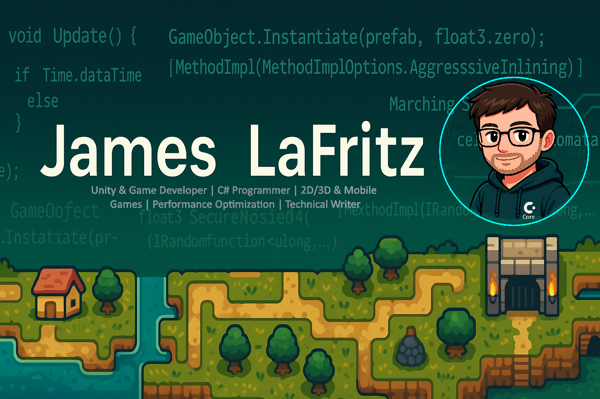

<!-- Banner Illustration -->

  

  
   
  
  

<h1 align="center">Hi, I'm James LaFritz 👋️</h1>

<em>
Game Developer specializing in Unity, C#, and performance-driven 2D/3D gameplay systems | Published Tech Writer
</em>

---

### 👨‍💻 About Me

- 🎮 **Unity Developer** with 3+ years of experience building 2D, 2.5D, 3D, and mobile games.
- 🛠️ **Core Skills:** Unity, C#, OOP, ScriptableObjects, design patterns, performance optimization, clean and scalable gameplay systems.
- 📝 **Published Technical Writer** (LogRocket, Medium) sharing insights on Unity, C#, shaders, and game architecture.
- 🤝 Strong collaborator, thorough documenter, and creative problem-solver—delivering results both independently and in teams.

---

### 💼 Recent Experience

- **Independent Contractor, Rara Games (2023):**  
  Developed advanced systems for _Castouts_: bug reporting wizard, screenshot annotation, and dynamic local/cloud settings management.

- **Unity Developer, GameDevHQ (2021–Present):**  
  Built multiple Unity projects (2D shooter, 2.5D platformer, 3D stealth, mobile Metroidvania) and robust frameworks with ScriptableObjects and custom inspectors.

- **Freelance Tech Writer, LogRocket (2022–Present):**  
  Published deep-dive articles on Unity Shader Graph, async/await vs coroutines, C# Job System, and Burst compiler.

---

###  Skills

 
 
  
 
 
  
 
  
 
  

---

###  Tech Stack

  <!-- Unity -->
  &nbsp;
  <!-- C# -->
  &nbsp;
  <!-- C++ -->
  &nbsp;
  <!-- C -->
  &nbsp;
  <!-- Python -->
  &nbsp;
  <!-- Python -->
  &nbsp;
  <!-- React -->
  &nbsp;
  <!-- VUE -->
  &nbsp;
  <!-- HTML 5 -->
  &nbsp;
  <!-- Boot Strap -->
  &nbsp;
  <!-- CSS 3 -->
  &nbsp;
  <!-- My SQL -->
  &nbsp;
  <!-- SQL Lite -->
  &nbsp;        
  <!-- Node JS -->
  &nbsp;&nbsp;
  <!-- PHP -->
  &nbsp;
  <!-- laravel -->
  &nbsp;
  <!-- Rider -->
  &nbsp;
  <!-- PHPStorm -->
  &nbsp;
  <!-- Visual Studio -->
  &nbsp;
  <!-- Docker -->
  &nbsp;
  <!-- Linux -->
  &nbsp;
  <!-- GitHub -->
  &nbsp;
  <!-- Git -->
  &nbsp;
  <!-- Bash -->
   &nbsp;

---

### 🚀 Featured Projects

  

---

### 📝 Favorite Articles

  
  
  

  
  
  
  
#### Latest

<a target="_blank" href="https://github-readme-medium-recent-article.vercel.app/medium/@ktmarine1999/0">

---

### 🌐 Connect & Learn More

- 
- 
- 
- 

---

   
   

  

  <em>Let's connect, collaborate, and build something amazing</em>

<!-- Not Used

### Articles:
#### General
* [Singleton Pattern](https://blog.devgenius.io/game-programming-pattern-singleton-4a0070ca489b)
* [Using Git](https://ktmarine1999.medium.com/setting-up-git-for-unity-2b6b3622afac)
* [More Productive Layout](https://ktmarine1999.medium.com/more-productive-editor-layout-in-unity-c9071f989c4f)
* [Custome Attributes](https://blog.devgenius.io/making-the-inspector-look-better-175baf39ada0)
* [ScriptableObject Variables](https://blog.devgenius.io/script-communication-in-unity-using-scriptable-objects-ad2ef0d99c59)
* [ScriptableObject Game Events](https://blog.devgenius.io/scriptableobject-game-events-1f3401bbde72)
* [Custom Package Manager Package](https://blog.devgenius.io/creating-custom-packages-for-use-in-unity-7dfbaa49e4b4)
* [Upgrading A Project In Unity](https://blog.devgenius.io/upgrading-a-project-77deff090cdd)
* [Using Unity's Animation System](https://blog.devgenius.io/using-the-unity-animation-system-2fe137a56008)
* [Collectables](https://blog.devgenius.io/creating-collectables-in-unity-3291e6b96521)

#### Character Controller
* [Physics Based without a rigidbody](https://blog.devgenius.io/creating-a-physics-based-character-controller-in-unity-54ac9a23e2b3)
* [Double Jump](https://blog.devgenius.io/how-to-add-double-jump-to-your-game-a9ae11b7df5e)
* [Wall Sliding/Jumping](https://blog.devgenius.io/wall-jumping-sliding-in-unity-296bb75a539)
* [Pushing Objects](https://blog.devgenius.io/pushing-objects-in-unity-to-complete-puzzles-8181fd4a77d1)
* [Adding Animations to a Rigid Character](https://blog.devgenius.io/adding-animations-to-a-rigged-character-in-unity-c47b291a829f)
* [Ledge Grabbing](https://blog.devgenius.io/completing-the-ledge-grabbing-system-9a4fef94be3b)
* [Lader System](https://blog.devgenius.io/ladder-system-22ed1a5bb8a8)

#### Moving Platforms
* [Part 1](https://blog.devgenius.io/moving-platforms-in-unity-4d7299b2d013)
* [Part 2](https://blog.devgenius.io/moving-platform-part-2-71b3addbc462)
* [A diffrent way (Best Way)](https://blog.devgenius.io/moving-platform-a-different-way-ce5992cc8dec)
* [Slope and Slop Point Formulas](https://blog.devgenius.io/slope-formula-and-slop-point-formula-16f2496dbb86)
 -->